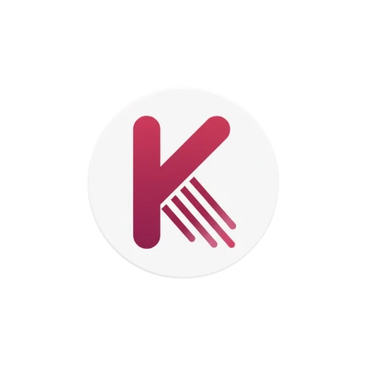

# ✨ Alat Spark
Alat, with a spark for Gen Z ✨

<div align="center">
  
  
  **Intelligent, AI powered financial insights powered by modern technology**
  
  [](https://alat-spark.vercel.app/)
  [](https://nextjs.org/)
</div>

---

## 👥 Team Syntax Squad
- **Ilori Oluwagbenga** - Project manager
- **Nathaniel Anthony** - Frontend Developer  
- **Bakrin Rufaydah** - UI/UX Designer
- **Oyedeji Samuel** - Backend Developer

---

## 🚀 Live Demo
Live Application: [Alat spark](https://alat-spark.vercel.app/)

Recorded Demo: https://www.loom.com/share/c92cfcb2c6f04db3b42d103fb1b3b4fb


## 🎯 The Problem
Digital payments only move money—but what if they could do more?
What if receiving a salary could automatically trigger savings?
What if splitting a bill could feel social instead of transactional?
What if small business owners could unlock insights directly from their payment history?

Today, payments lack context and miss these opportunities.
They are utilities, when they could be experiences.

## ✨ Our Solution

Alat Spark reimagines financial management through intelligent insights and seamless user experiences. Our platform combines modern banking interfaces with smart analytics to help users better understand and control their financial journey.

### Key Features
- 📊 **Dashboard Analytics** - Visual spending insights and trends
- 💳 **Transaction Management** - Smart categorization and tracking
- 🎯 **Financial Goals** - Personalized recommendations and alerts
- 📱 **Mobile-First Design** - Responsive across all devices

---

## 🛠️ Tech Stack

- **Frontend:** Next.js 15, React 19, TypeScript
- **Styling:** Tailwind CSS, Framer Motion
- **UI Components:** Radix UI, Lucide Icons
- **Charts:** Recharts
- **AI Integration:** Google Generative AI
- **Deployment:** Vercel

---

## ⚙️ How to Set Up and Run Locally

```bash
# Clone repository
git clone https://github.com/Wema-Hackaholics-Hackathon/wema-hackaholics6-0-hackathon-ui-project-syntax-squad
cd wema-hackaholics6-0-hackathon-ui-project-syntax-squad

# Install dependencies
npm install

# Start development server
npm run dev
```

Visit `http://localhost:3000` to see the application.

---

## 🔮 Future Roadmap

- Advanced AI-powered financial recommendations
- Integration with multiple banking APIs
- Enhanced data visualization and reporting
- Mobile app development
- Multi-currency support

---

<div align="center">
  <strong>Built with ❤️ by Team Syntax Squad</strong>
</div>